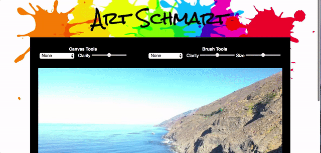
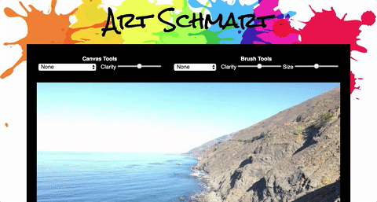

# Art Schmart

[Art Schmart Live](http://amytfang.me/ArtSchmart/)

Art Schmart is a JavaScript-based image manipulation tool that enables users to create versions of their own images styled to reflect the Impressionism and Pointillism art movements.  Additionally, brush tools allow users to layer either brushstrokes or dots upon specific portions of their images.





## Features

* Upload images or choose from three demo images
* Toggle the entire image between Impressionism style, Pointillism style, and the original image
* Select the level of clarity for the entire image
* Use brush tools to draw Impressionistic brushstrokes or Pointillism dots overlaid upon specific areas of the image with the mouse
* Adjust the clarity level and size of the brush

## Technologies Used

* JavaScript
* Canvas

## Features Implementation

### Pixel Level Manipulation

When an image is first uploaded, it is loaded onto the `Canvas` element of the DOM.  Once the image is loaded to the DOM, a `Canvas` method fetches the image data, which includes a `Uint8ClampedArray` representing a one-dimensional array containing the data in the RGBA order with integer values between 0 and 255.  This `Uint8ClampedArray` array is used to create an array of `Pixel` objects which store the RGBA value and position of each pixel in the image.  

```javascript
createPixelArray() {
  this.pixelMap = [];
  for (let i = 0; i < this.colorsArray.length; i += 4) {
    const x = Math.floor((i % (this.width * 4)) / 4);
    const y = Math.floor(i / (this.width * 4));
    const r = this.colorsArray[i];
    const g = this.colorsArray[i + 1];
    const b = this.colorsArray[i + 2];
    const a = this.colorsArray[i + 3];
    this.pixelMap.push(new Pixel([x, y], r, g, b, a));
  }
}
```

This array of `Pixel`s allows the application to index into the array with just the position of a pixel and make adjustments at the pixel level.  

```javascript
const pixel = [46, 20]; // given a set of coordinates
let index = (pixel[0] + pixel[1] * this.width); // finds the index of the coordinates in the pixelMap
```

Additionally, the `Pixel` object holds a `shift` method for implementing Impressionism style in accordance with the white paper entitled ["Non-photorealistic image processing: an Impressionist rendering"](https://arxiv.org/pdf/0911.4874.pdf) which calls for shifting the pixels prior to rendering in an Impressionistic rendering.  

```javascript
class Pixel {
  ...

  shift() {
    const xRand = Math.floor(Math.random() * 20) - 10;
    const yRand = Math.floor(Math.random() * 20) - 10;
    this.newPos = [this.pos[0] + xRand, this.pos[1] + yRand];
  }
}
```

### Impressionistic Rendering

As discussed above, the Impressionist rendering of the image is based in part on the white paper entitled ["Non-photorealistic image processing: an Impressionist rendering"](https://arxiv.org/pdf/0911.4874.pdf).  In addition to the paper, the process was modified to account for the limitations of `Canvas`, optimized rendering, and allowing for user interaction.

Specifically, to render an image in the Impressionistic style, a `Painter` object will iterate over a randomly generated subset of `Pixel`s from its `pixelMap` instance variable and draw a quadratic curve shape filled with the RGBA value of those `Pixel`s slightly shifted from the `Pixel`'s original position.  The size of the subset of `Pixel`s will vary based on the clarity level the user chooses.  The lower the clarity level, the bigger the quadratic curve shape sizes, and the fewer samples.  The quadratic curves randomly vary in order to produce a more naturalistic rendering.

```javascript
makeImpression(fullImage = true) {
  const pixelCount = 100000 / this.canvasClarity;
  const pixelSample = Util.getRandomSubarray(this.pixelMap, pixelCount);
  pixelSample.forEach((pixel) => {
    this.drawCurve(pixel, this.canvasClarity);
  });
}

drawCurve(pixel, clarity) {
  const posX = pixel.newPos[0];
  const posY = pixel.newPos[1];
  const ctx = this.painting.ctx;
  const width = Math.random() * clarity * 6;
  const height = Math.random() * clarity * 6;

  ctx.beginPath();
  ctx.moveTo(posX, posY);
  ctx.quadraticCurveTo(posX - width, posY, posX, posY + height);

  ctx.fillStyle = `rgba(${pixel.r}, ${pixel.g}, ${pixel.b}, ${pixel.a})`;
  ctx.fill();
  ctx.closePath();
}
```

### Pointillistic Rendering

The Pointillistic rendering of an image creates a grid of circles, each containing a single color, and allows the human eye to blend the colors and create the image.  Because we have the ability to index into the `pixelMap` based on the x and y coordinates of the pixels of the image, the user can select the clarity level for the rendered image and the program can simply adjust the spacing between the rendered circles by changing how we iterate.  Unlike the Impressionistic rendering, the Pointillistic rendering clears the canvas prior rendering to reflect to obvious whitespace used in Pointillistic paintings.

```javascript
makePoint() {
  const ctx = this.painting.ctx;
  ctx.clearRect(0, 0, 900, 600);
  const spacing = this.canvasClarity * 4;
  for (let i = (900 % spacing === 0) ? spacing / 2 : 0; i < 900; i += spacing) {
    for (let j = (600 % spacing === 0) ? spacing / 2 : 0; j < 600; j += spacing) {
      let index = (i + j * this.width);
      this.drawCircle(this.pixelMap[index], this.canvasClarity);
    }
  }
}

drawCircle(pixel, clarity) {
  const posX = pixel.pos[0];
  const posY = pixel.pos[1];
  const ctx = this.painting.ctx;

  ctx.beginPath();
  ctx.arc(posX, posY, clarity * 2, 0, 2 * Math.PI);
  ctx.fillStyle=`rgba(${pixel.r}, ${pixel.g}, ${pixel.b}, ${pixel.a})`;
  ctx.fill();
}
```

### Brush Tools

In addition to altering the entirety of images, Art Schmart also allows users to use brush tools to create the Impressionism or Pointillism effect selectively by overlaying brushstrokes or dots on areas specified by the user. Users can select a brush size and a style and then use their mouse to change the `Canvas` image.  

To selectively alter images in this fashion, Art Schmart has an utility function that finds all of the coordinates in a circular area given a starting set of coordinates and a radius value.  This utility function takes advantage of the symmetrical nature of a circle to find the included coordinates for one quadrant and use that quadrant to determined the included coordinates of the other three.  

```javascript
includedCoords(pos, radius) {
  const x = pos[0];
  const y = pos[1];
  let coordinates = [[x, y]];

  for (let i = radius; i > 0; i--) {
    coordinates = coordinates.concat(Util.checkBounds(
      [[x + i, y],
      [x - i, y],
      [x, y + i],
      [x, y - 1]]
    ));
  }

  for (let j = radius; j > 0; j--) {
    if ((j * j) + (j * j) <= (radius * radius)) {
      coordinates = coordinates.concat(Util.checkBounds(
        [[x + j, y + j],
        [x - j, y + j],
        [x + j, y - j],
        [x - j, y - j]]
      ));
    }
  }

  for (let k = 1; k < radius; k++) {
    for (let l = 1; l < radius; l++) {
      if (k === l) continue;
      if ((k * k) + (l * l) <= (radius * radius)) {
        coordinates = coordinates.concat(Util.checkBounds(
          [[x + k, y + l],
          [x - k, y + l],
          [x + k, y - l],
          [x - k, y - l]]
        ));
      }
    }
  }
  return coordinates;
}
```

From the array of coordinates, a random subset is generated and then either `drawCurve` or `drawCircle` is called on the `Pixel`s that those positions.  These images are overlayed on whatever was previously on the `Canvas`.  
